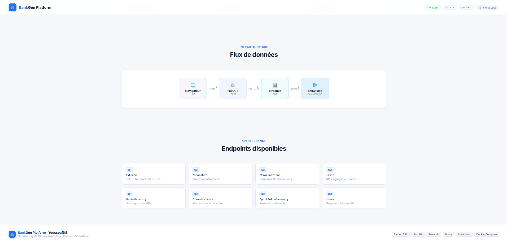
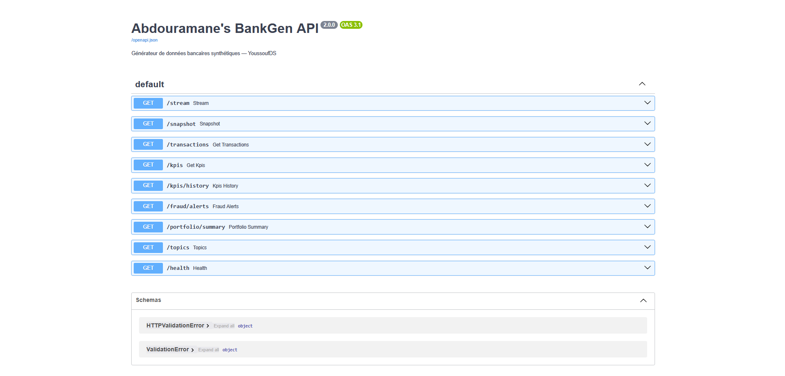
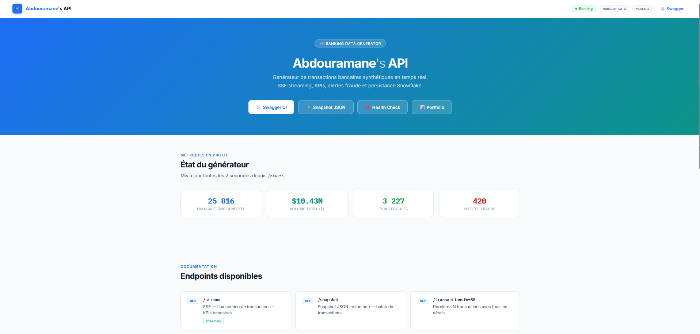
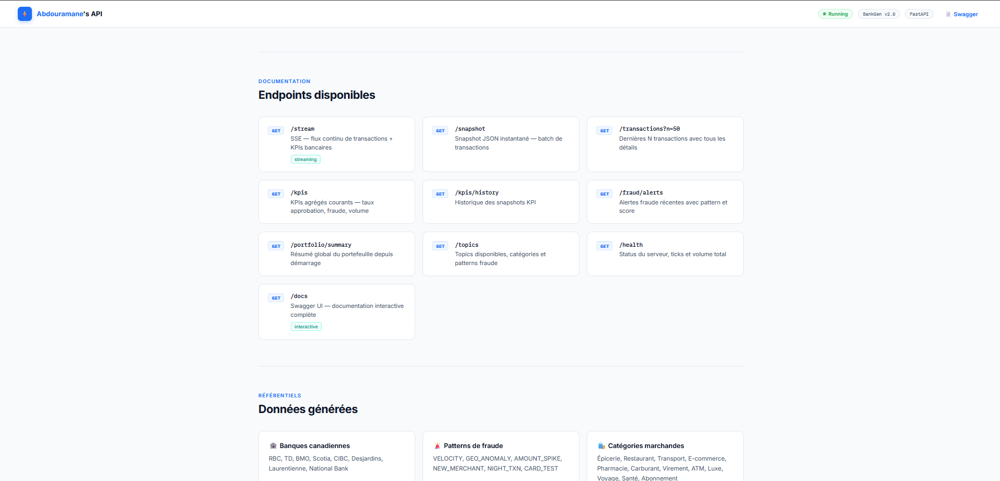
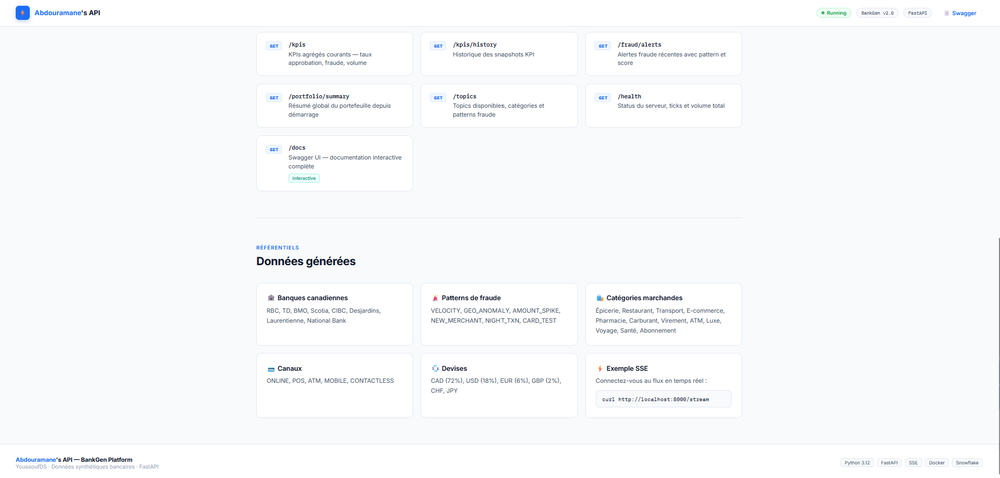
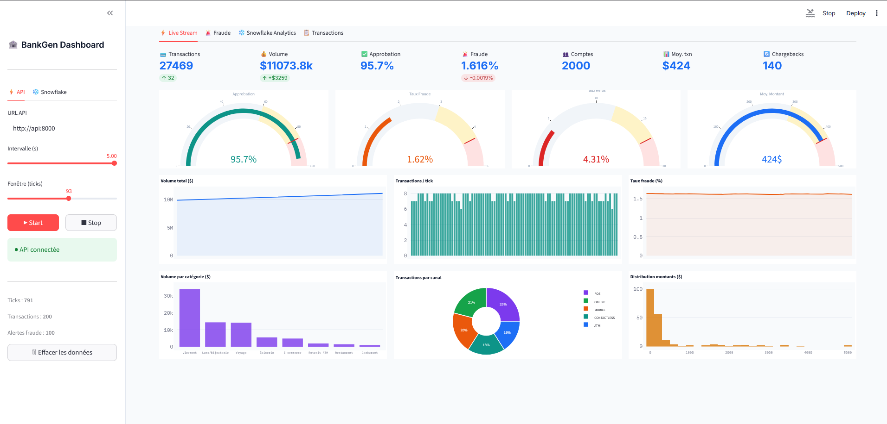
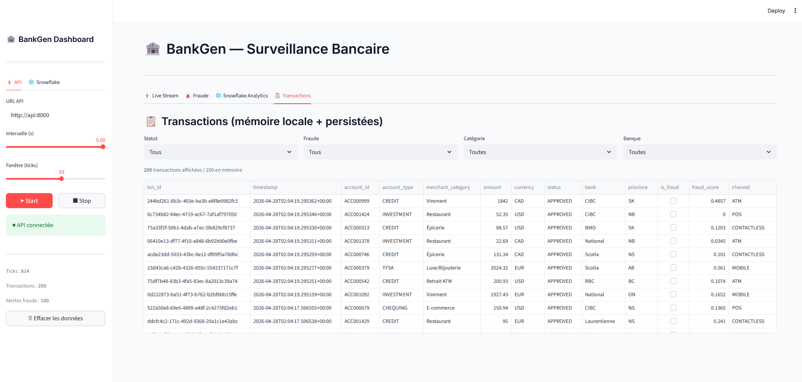
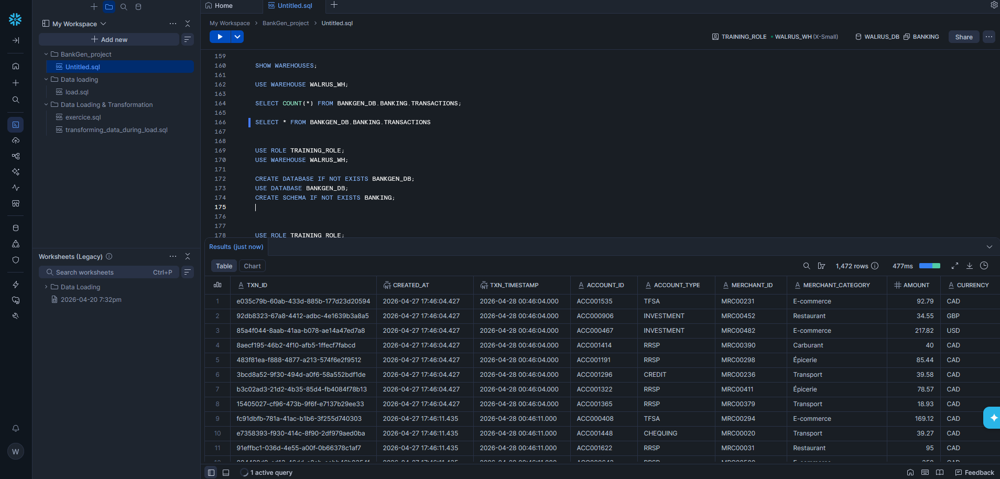
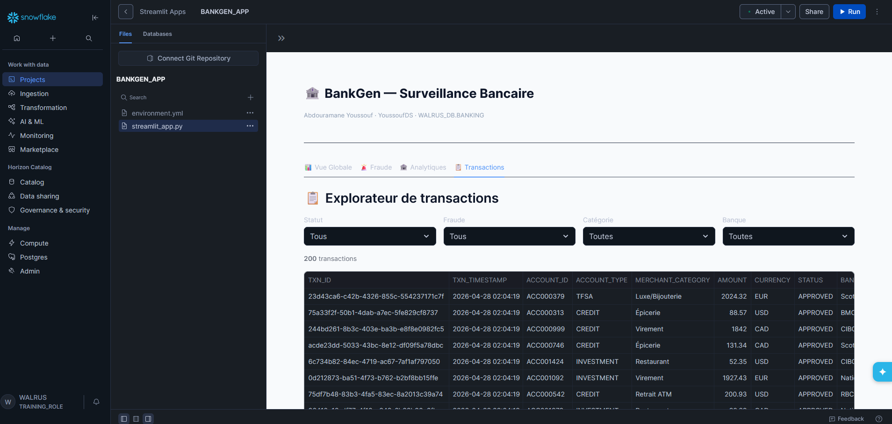
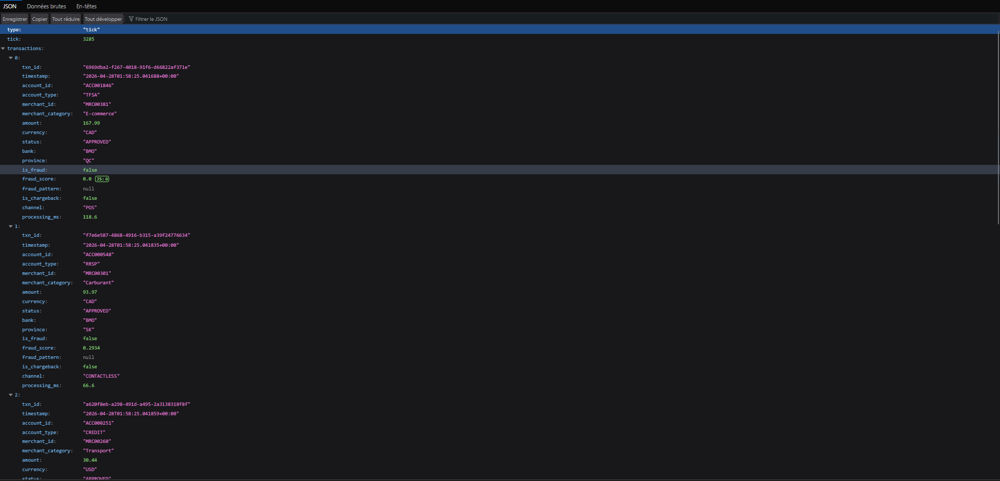

# 🏦 BankGen Platform — Real-Time Banking Data Generator

> **Abdouramane Youssouf (YoussoufDS)** · Master BI & Analytics · HEC Montréal  
> Plateforme complète de génération de données bancaires synthétiques en temps réel, avec persistance Snowflake et double dashboard analytique.

---

## 🏠 Page d'accueil




---

## ⚡ Abdouramane's API









---

## 📊 Dashboard Temps Réel (Docker)






---

## ❄️ Snowflake Analytics






---

## 📡 JSON Stream



---

## 🏗️ Architecture

```
FastAPI (BankGen API)  :8000
        ↓ SSE Streaming
Streamlit Dashboard    :8501  ──→  Snowflake (WALRUS_DB.BANKING)
        ↑                               ↑
  Landing Page :80              Streamlit Snowflake App
```

---

## 🚀 Stack technique

| Composant | Technologie |
|-----------|-------------|
| Générateur de données | Python · FastAPI · SSE |
| Dashboard temps réel | Streamlit · Plotly |
| Persistance | Snowflake (RSA Key Pair Auth) |
| Dashboard analytique | Snowflake Streamlit App |
| Infrastructure | Docker · Docker Compose · ARM64 |

---

## 📊 Données générées

| Dimension | Détail |
|-----------|--------|
| **Catégories marchandes** | Épicerie, Restaurant, E-commerce, Transport, Pharmacie, Carburant, Virement, ATM, Luxe, Voyage, Santé, Abonnement |
| **Banques canadiennes** | RBC, TD, BMO, Scotia, CIBC, Desjardins, Laurentienne, National |
| **Patterns de fraude** | VELOCITY, GEO_ANOMALY, AMOUNT_SPIKE, NEW_MERCHANT, NIGHT_TXN, CARD_TEST |
| **Canaux** | ONLINE, POS, ATM, MOBILE, CONTACTLESS |
| **Devises** | CAD (72%), USD (18%), EUR (6%), GBP (2%), CHF, JPY |
| **Types de compte** | CHEQUING, SAVINGS, CREDIT, INVESTMENT, RRSP, TFSA |

---

## ⚡ Démarrage rapide

### 1. Cloner le repo
```bash
git clone https://github.com/YoussoufDS/bankgen-platform.git
cd bankgen-platform
```

### 2. Générer les clés RSA pour Snowflake
```bash
openssl genrsa -out rsa_key.pem 2048
openssl pkcs8 -topk8 -inform PEM -outform PEM -nocrypt -in rsa_key.pem -out rsa_key.p8
openssl rsa -in rsa_key.pem -pubout -out rsa_key.pub
```

### 3. Enregistrer la clé dans Snowflake
```sql
ALTER USER ton_username SET RSA_PUBLIC_KEY='...contenu de rsa_key.pub...';
```

### 4. Initialiser les tables Snowflake
```sql
-- Exécuter sql/setup_snowflake.sql dans Snowflake Worksheet
USE ROLE TRAINING_ROLE;
USE WAREHOUSE WALRUS_WH;
-- Puis coller le contenu de setup_snowflake.sql
```

### 5. Lancer Docker
```bash
docker compose up --build
```

### 6. Accéder aux services

| Service | URL |
|---------|-----|
| 🏠 Landing Page | http://localhost |
| ⚡ Abdouramane's API | http://localhost:8000 |
| 📄 Swagger UI | http://localhost:8000/docs |
| 📊 Dashboard Live | http://localhost:8501 |

---

## 📁 Structure du projet

```
bankgen-platform/
├── main.py                    ← FastAPI — BankGen API + page d'accueil
├── dashboard.py               ← Streamlit Docker (temps réel + Snowflake)
├── dashboard_snowflake.py     ← Streamlit App Snowflake (natif)
├── Dockerfile.api             ← Image Docker FastAPI
├── Dockerfile.dashboard       ← Image Docker Streamlit
├── docker-compose.yml         ← Orchestration 3 services
├── requirements.txt           ← Dépendances Python
├── .env.example               ← Template variables Snowflake
├── .gitignore                 ← Protège clés RSA et .env
├── images/                    ← Captures d'écran du projet
├── landing/
│   └── index.html             ← Page d'accueil avec métriques live
└── sql/
    └── setup_snowflake.sql    ← Tables & vues analytiques Snowflake
```

---

## 🗄️ Schéma Snowflake

```
WALRUS_DB.BANKING
├── TRANSACTIONS           ← Transactions bancaires (principale)
├── KPI_SNAPSHOTS          ← KPIs agrégés par tick
├── FRAUD_ALERTS           ← Alertes fraude
├── V_VOLUME_BY_CATEGORY   ← Volume par catégorie marchande
├── V_APPROVAL_BY_BANK     ← Taux approbation par banque
├── V_FRAUD_BY_PATTERN     ← Fraude par pattern
├── V_TXN_BY_PROVINCE      ← Transactions par province
└── V_KPI_LAST_HOUR        ← KPIs dernière heure (glissant)
```

---

## 🏢 Applications en entreprise

| Ce projet | Équivalent production |
|-----------|----------------------|
| Générateur SSE FastAPI | Kafka / Kinesis / événements core banking |
| Insertion Snowflake directe | Fivetran / Spark Structured Streaming |
| Dashboard Docker temps réel | Grafana / Power BI Premium Real-Time |
| Snowflake Streamlit App | Tableau / Power BI / Looker |
| Auth RSA PKCS8 | Vault / Azure Key Vault |

---

## 🔗 Liens

- **LinkedIn** : [Abdouramane Youssouf](https://www.linkedin.com/in/youssoufds)
- **GitHub** : [YoussoufDS](https://github.com/YoussoufDS)

---

## 📄 Licence

MIT License — libre d'utilisation pour des fins éducatives et personnelles.
